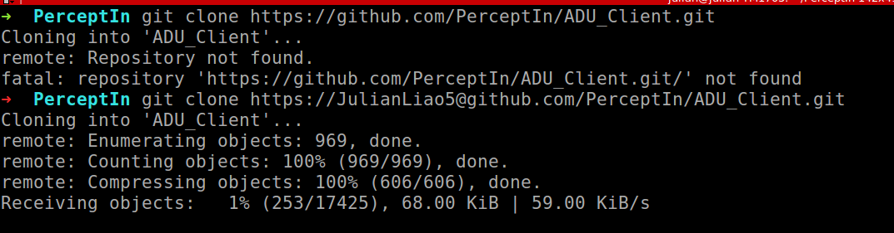

# Ubuntu_issues

## 电脑相关的
G7 7590-2765

```
处理器：
    i7-9750H
        4.5GHz  6核心  12线程

内存：
    16GB

注意：没有机械硬盘

固态硬盘：
    512GB PCIe SSD

15.6英寸显示屏
    1920 × 1080 IPS 72%色域 144Hz 全高清 防眩光

显卡：
    GTX 1660Ti 6GB
```

日期 | 产品 | 显卡 | cpu | 内存 | 硬盘 | 平台 | 店铺名 | 价格
-----|-----|------|-----|-----|------|------|-------|-------
2019.07.29  |  G7 7590-2765  |  GTX 1660Ti 6GB  |  i7-9750H  |  16G(2 * 8GB)  |  512G PCIe SSD  |  淘宝  |  戴尔官方旗舰店  |  10998.90元
2019.07.29  |  G7 7590-2765  |  GTX 1660Ti 6GB  |  i7-9750H  |  16G(2 * 8GB)  |  512G PCIe SSD  |  京东  |  戴尔官方旗舰店  |  10999元
2019.08.23  |  G7 7590-2765  |  GTX 1660Ti 6GB  |  i7-9750H  |  16G(2 * 8GB)  |  512G PCIe SSD  |  淘宝  |  戴尔官方旗舰店  |  10998.90元
2019.08.23  |  G7 7590-2765  |  GTX 1660Ti 6GB  |  i7-9750H  |  16G(2 * 8GB)  |  512G PCIe SSD  |  京东  |  戴尔官方旗舰店  |  11399元
2019.08.26  |  G7 7790-2865  |  RTX 2060 6GB  |  i7-9750H  |  16G(2 * 8GB)  |  512G PCIe SSD  |  淘宝  |  戴尔官方旗舰店  |  12998
2019.08.26  |  G7 7790-2865  |  RTX 2060 6GB  |  i7-9750H  |  16G  |  512G PCIe SSD  |  淘宝  |  戴尔蓝印专卖店  |  12499
2019.08.26  |  G7 7590-2865  |  RTX 2060 6GB  |  i7-9750H  |  16G(2 * 8GB)  |  512G PCIe SSD  |  京东  |  戴尔官方旗舰店  |  12999元

### GPU比较

https://www.nvidia.com/en-us/geforce/products/10series/compare/

https://www.geforce.com/hardware/compare-buy-gpus

https://www.cgdirector.com/nvidia-graphics-cards-order-performance/

## sudo apt-get related issues
a.
问题描述：
```
    The following signatures couldn't be verified because the public key is not available: NO_PUBKEY F42ED6FBAB17C654
```

解决办法：
```
    sudo apt-key adv --keyserver keyserver.ubuntu.com --recv-keys F42ED6FBAB17C654
```

## 翻墙

### 如何通过.crx文件在chrome里面装上插件？

## git issues

a.
问题描述：
```
    当执行git push origin master，提示以下错误，

    remote: Permission to JulianLiao5/cpp_basics.git denied to JulianLiao.
    fatal: unable to access 'https://github.com/JulianLiao5/cpp_basics.git/': The requested URL returned error: 403
```
解决办法：
```
    git remote set-url origin git@github.com:Julianliao5/cpp_basics.git
```


b.
问题描述：
```
    当执行git clone https://github.com/PerceptIn/ADU_Client.git，提示以下错误，

    remote: Repository not found.
    fatal: repository 'https://github.com/PerceptIn/ADU_Client.git/' not found
```
解决办法1：
```
git clone https://JulianLiao5@github.com/PerceptIn/ADU_Client.git
```



c.
问题描述：
```
    当执行git pull时，报
    remote: Repository not found.
    fatal: repository 'https://github.com/PerceptIn/ADU_Client.git/' not found
```

尝试解决办法1（not work）
```
git remote set-url origin https://github.com/PerceptIn/ADU_Client.git/，仍然报错
```

解决办法2(work)
```
git remote set-url origin git@github.com:PerceptIn/ADU_Client.git
```


d. 如何保存git的用户名和密码，不用每次做git pull 或者 git push都需要输入。

```shell
$ git config --global credential.helper store
$ git pull
Username: <type your username>
Password: <type your password>
```

## ssh issues

a. 登录到miniPC后，opengl UI无法显示出来

问题描述：

miniPC没有独立显卡，Dell G3笔记本 和 联想X1笔记本通过[ssh -C -X -Y perceptin@192.168.8.11]登录到miniPC后，运行
```bash
$ cd PI_SDK_v1.5/modules/planning/bin
$ ./run.sh （含--enable_visualization=true）
```
不能打开opengl UI，同时报以下错误，


原因：

远程电脑的opengl版本与自己电脑的opengl版本不一致。

miniPC（没有显卡）的opengl版本如下：


其"OpenGL version string"为 "3.0 Mesa 18.0.5"。

而Dell G3的opengl版本如下：


其"OpenGL version string"为 "4.6.0 NVIDIA 410.78"。

我的小米笔记本同样没有显卡，其opengl版本与miniPC的opengl版本是相一致的，如下：


解决办法(work)：

使用小米笔记本通过ssh -C -X -Y perceptin@192.168.8.11登录miniPC，就可以在小米本上正常显示OpenGL UI了。