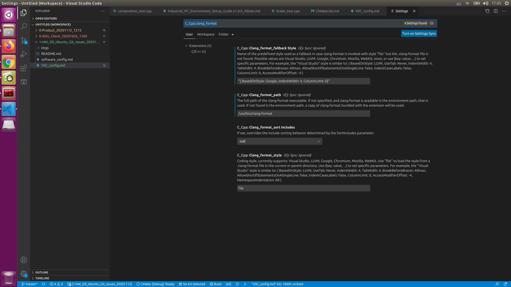

## 1. Using google style with Clang-format 

好的文章推荐： https://stackoverflow.com/questions/45823734/visual-studio-code-formatting-for



对于文件的format，也可以直接使用以下命令，

```shell
$ clang-format -style=Google -i file.cc  ## -i                        - Inplace edit <file>s, if specified.
```
