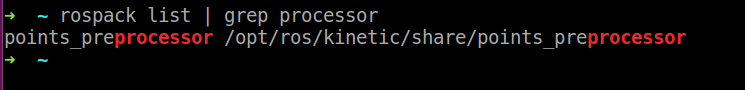

# ros命令

roslaunch prototype:
```shell
$ roslaunch package_name file.launch
$ roslaunch <package-name> <launch-filename> [args]  ## roslaunch会找到存在于指定的package中的launch文件并且启动这个launch文件
```

rosrun prototype:
```shell
$ rosrun [package_name] [node_name]  ## rosrun可以不用知道package路径，而通过package_name直接启动它里面的node
```

rospack prototype:

查看是否有某个 package

```shell
$ rospack list | grep [package_name]
```




# ros topic

## 如何广播(publish)和订阅(subscribe)一个topic

广播一个ros topic用的是 ros::NodeHandle 类。订阅一个ros topic同样使用的是 ros::NodeHandle类。

举一个很简单来说明是如何发topic的？

```c++
ros::Publisher pub = nh.advertise<std_msgs::String>("topic_name", 5);
std_msgs::String str;
str.data = "hello world";
pub.publish(str);
```

ros::NodeHandle的 advertise函数的prototype如下：

```c++
template<class M>
ros::Publisher advertise(const std::string& topic, uint32_t queue_size, bool latch = flase);

# M: 必须要指定的，就是你想通过这个topic名发怎样的消息出去

# queue_size:
  outgoing message队列大小。如果你发消息的速度快过了roscpp通过硬件线缆发消息的速度，那么roscpp就会干掉超过了queue_size 的消息。

```


ros::NodeHandle的subscribe函数的prototype如下：

```c++
template<class M>
ros::Subscriber subscribe(const std::string& topic, uint32_t queue_size, <callback, which may involve multiple arguments>, const ros::TransportHints& transport_hints = ros::TransportHints());

# M，通常不需要指定
  与advertise不同的是，subscribe通常不需要指定。

# queue_size
  incoming messages队列大小
  可以认为是第三个参数callback 被触发的参数队列大小，如果callback被触发的太频繁导致不能被处理得过来的话，roscpp就会把超过 queue_size消息给扔掉。
```


3i robotics的Delta-1A 通过rostopic 手法的消息类型并非自定义的消息类型，而是用的ros官方的消息类型 sensor_msgs/LaserScan.msg。


# ros本身所包含的消息类型

## sensor_msgs

### sensor_msgs/LaserScan.msg, sensor_msgs/LaserScan.h

```
Header header  ## std_msgs/Header Header
float32 angle_min
float32 angle_max
float32 angle_increment
float32 time_increment
float32 scan_time
float32 range_min
float32 range_max
float32[] ranges
float32[] intensities
```
